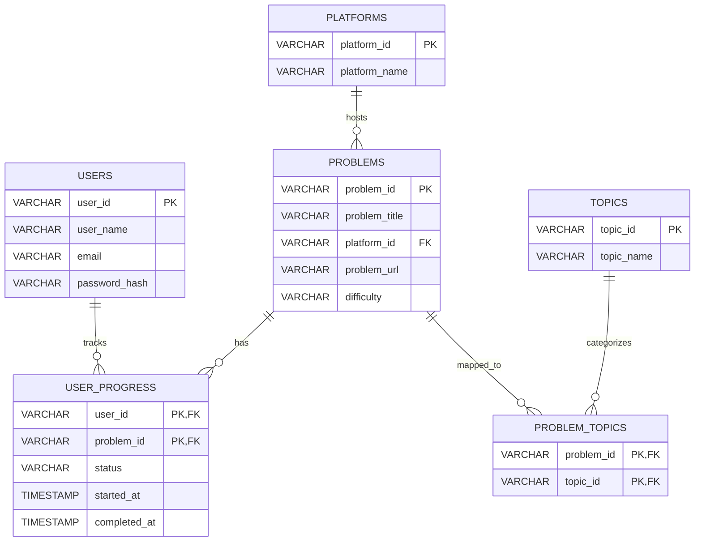

# Nova Placement Preparation Platform – ER Diagram

```mermaid
erDiagram
    USERS {
        VARCHAR user_id PK
        VARCHAR user_name
        VARCHAR email
        VARCHAR password_hash
    }

    PLATFORMS {
        VARCHAR platform_id PK
        VARCHAR platform_name
    }

    PROBLEMS {
        VARCHAR problem_id PK
        VARCHAR problem_title
        VARCHAR platform_id FK
        VARCHAR problem_url
        VARCHAR difficulty
    }

    TOPICS {
        VARCHAR topic_id PK
        VARCHAR topic_name
    }

    PROBLEM_TOPICS {
        VARCHAR problem_id PK, FK
        VARCHAR topic_id PK, FK
    }

    USER_PROGRESS {
        VARCHAR user_id PK, FK
        VARCHAR problem_id PK, FK
        VARCHAR status
        TIMESTAMP started_at
        TIMESTAMP completed_at
    }

    USERS ||--o{ USER_PROGRESS : tracks
    PROBLEMS ||--o{ USER_PROGRESS : has
    PLATFORMS ||--o{ PROBLEMS : hosts
    PROBLEMS ||--o{ PROBLEM_TOPICS : mapped_to
    TOPICS ||--o{ PROBLEM_TOPICS : categorizes
```
